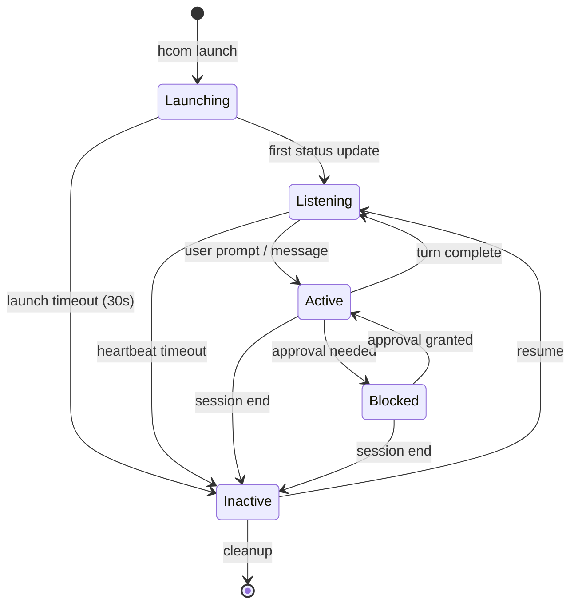

## Agent States

Agents transition through several states during their lifecycle:

<CardGroup cols={2}>
  <Card title="Launching" icon="rocket">
    Instance created but session not yet bound (< 30s)
  </Card>
  <Card title="Listening" icon="ear-listen">
    Idle, ready to receive messages (< 1s response)
  </Card>
  <Card title="Active" icon="bolt">
    Processing, reading messages very soon
  </Card>
  <Card title="Blocked" icon="hand">
    Needs human approval to continue
  </Card>
  <Card title="Inactive" icon="circle">
    Stopped, stale, or disconnected
  </Card>
</CardGroup>

## State Machine



## Lifecycle Phases

### 1. Creation

<Steps>
  <Step title="Name allocation">
    Generate CVCV name (e.g., luna, nova, kira) using softmax sampling from scored pool
  </Step>
  <Step title="Name reservation">
    Acquire flock on `~/.hcom/.tmp/name_gen.lock` and create placeholder row
  </Step>
  <Step title="Launch">
    Spawn tool process in new terminal pane with `HCOM_PROCESS_ID` env var
  </Step>
  <Step title="Hook installation">
    Tool-specific hooks are already installed at `~/.{tool}/hooks/`
  </Step>
</Steps>

### 2. Initialization

When the tool starts:

<Steps>
  <Step title="SessionStart hook">
    First hook fires with session_id and transcript_path
  </Step>
  <Step title="Identity binding">
    `bind_session_to_process()` links session_id to instance name
  </Step>
  <Step title="Bootstrap injection">
    Hook injects welcome message and hcom introduction
  </Step>
  <Step title="Ready event">
    First status update triggers life event: `{"action": "ready"}`
  </Step>
</Steps>

### 3. Active Operation

During normal operation:

<CodeGroup>
```rust Status Updates
// Agent transitions between states
set_status(db, "luna", "active", "tool:Bash", "", "", None, None);
set_status(db, "luna", "listening", "", "", "", None, None);
set_status(db, "luna", "blocked", "pty:approval", "", "", None, None);
```

```rust Heartbeat
// Delivery threads update heartbeat every poll
db.update_heartbeat("luna")?;
// Sets last_stop = now and tcp_mode = 1
```

```rust Message Delivery
// Hook delivers messages on Poll/Stop
let messages = db.get_unread_messages("luna");
let formatted = format_messages_json(&messages, "luna", ...);
// Returns: HookResult::Block { reason: formatted }
```
</CodeGroup>

### 4. Termination

When the session ends:

<Steps>
  <Step title="SessionEnd hook">
    Final hook fires before tool exits
  </Step>
  <Step title="Stopped event">
    Life event logged: `{"action": "stopped", "reason": "exit:0"}`
  </Step>
  <Step title="Status inactive">
    Instance marked inactive with exit context
  </Step>
  <Step title="Cleanup">
    Stale placeholders and endpoints cleaned up after threshold
  </Step>
</Steps>

## Agent Types

### PTY Agents

Launched with `hcom [N] {tool}` in managed terminal:

- Full hook integration (Pre/Post/Notify)
- TCP delivery thread for instant message injection
- Terminal pane management (kitty, wezterm, tmux)
- PID tracking for orphan recovery

### Headless Agents

Launched with `hcom [N] {tool} -p "prompt"` in background:

- Same hook integration as PTY
- No terminal UI
- Background log file for output
- Daemon-style operation

### Vanilla Agents

Run tool manually, then `hcom start` inside:

- Polling-based message delivery (no TCP thread)
- Manual hook installation required
- Works with any AI tool that can run shell commands

### Ad-hoc Senders

Fire-and-forget external processes:

```bash
hcom send @luna -- "task complete" --from botname
```

- No session binding
- No message polling
- External sender identity

## Identity Management

### Session Binding

The `bind_session_to_process()` function handles 4 paths:

<Tabs>
  <Tab title="Path 1a: Canonical + Placeholder Merge">
    ```rust
    // Session already bound to "luna" (canonical)
    // Process bound to "nova" (placeholder)
    // → Merge placeholder into canonical, delete placeholder
    
    canonical_name = "luna"
    placeholder_name = "nova"
    
    // Migrate TCP endpoints
    db.migrate_notify_endpoints("nova", "luna")
    
    // Copy tag/background from placeholder
    // Delete placeholder row
    db.delete_instance("nova")
    
    return Some("luna")
    ```
  </Tab>
  
  <Tab title="Path 1b: Canonical + Session Switch">
    ```rust
    // Session bound to "luna" (canonical)
    // Process bound to "nova" (real instance, not placeholder)
    // → Session switched from nova to luna
    
    // Mark old instance inactive
    set_status(db, "nova", "inactive", "exit:session_switch", ...)
    
    // Migrate endpoints to canonical
    db.migrate_notify_endpoints("nova", "luna")
    
    return Some("luna")
    ```
  </Tab>
  
  <Tab title="Path 2: Placeholder Bind">
    ```rust
    // No canonical, placeholder exists
    // → Bind session to placeholder
    
    placeholder_name = "luna"
    
    // Clear conflicts
    db.clear_session_id_from_other_instances(session_id, "luna")
    
    // Update placeholder with session_id
    db.update_instance_fields("luna", {"session_id": session_id})
    db.rebind_session(session_id, "luna")
    
    return Some("luna")
    ```
  </Tab>
  
  <Tab title="Path 3/4: No-op">
    ```rust
    // No canonical, no placeholder
    // → First hook will create instance
    
    return None
    ```
  </Tab>
</Tabs>

### Name Generation

CVCV (consonant-vowel-consonant-vowel) pattern:

```rust
// Scored name pool (5000 names)
// Gold names (curated): +4000 points
// Flow letters (l,r,n,m): +40 points
// One v/z: +12 points
// Name-like endings (a,e,o): +6 points

// Softmax sampling with temperature 900
let weights: Vec<f64> = pool
    .iter()
    .map(|x| ((x.score - max_score) / 900.0).exp())
    .collect();

// Hamming rejection (distance <= 2 to alive names)
if is_too_similar(name, alive_names) {
    continue;
}
```

Example names: luna, nova, kira, mila, loki, zara, sora

## Status Computation

### Heartbeat Timeout

Listening status requires fresh heartbeat:

```rust
if current_status == "listening" {
    let heartbeat_age = now - last_stop;
    let threshold = if has_tcp { 35 } else { 10 };
    
    if heartbeat_age > threshold {
        if wake_grace {
            age = 0; // Grace period active
        } else {
            current_status = "inactive";
            context = "stale:listening";
        }
    }
}
```

### Activity Timeout

Non-listening, non-inactive states timeout after 5 minutes:

```rust
if current_status != "inactive" && current_status != "listening" {
    let status_age = now - status_time;
    
    if status_age > 300 {
        if !wake_grace && heartbeat_stale {
            current_status = "inactive";
            context = format!("stale:{}", prev_status);
        }
    }
}
```

### Sleep/Wake Detection

Detect laptop sleep via wall-clock vs monotonic drift:

```rust
let mono_elapsed = now_mono - last_mono;
let wall_elapsed = now_wall - last_wall;
let drift = wall_elapsed - mono_elapsed;

if drift > 30.0 {
    // Sleep detected, grant 60s grace period
    grace_until = now_mono + 60.0;
}
```

## Cleanup

### Stale Instance Cleanup

Automatic cleanup of dead instances:

```rust
// Placeholder timeout: 2 minutes
if is_launching_placeholder(data) {
    let age = now - data.created_at;
    if age > 120 {
        db.delete_instance(&data.name);
    }
}

// Inactive instances: keep for archive queries
// Remote instances: trust synced status
```

### Orphan Recovery

After schema bump/archive:

1. Before archive: snapshot running instances to `launched_pids.json`
2. After reconnect: check pidfile
3. If process alive: re-register with `create_orphaned_pty_identity()`
4. Restore notify endpoints, session binding

## Subagents

Claude Task tool spawns child instances:

```rust
// Parent context
parent_session_id = "sess-abc"
parent_name = "luna"

// Subagent creation
subagent_name = generate_unique_name(db)?;
db.save_instance_named(subagent_name, {
    "parent_session_id": parent_session_id,
    "parent_name": parent_name,
    "subagent_timeout": 30, // seconds
});

// Subagent tracking
update_running_tasks(db, "luna", {
    "active": true,
    "subagents": [subagent_name]
});
```

Subagents timeout after 30s of inactivity (configurable via `hcom config subagent_timeout`).
