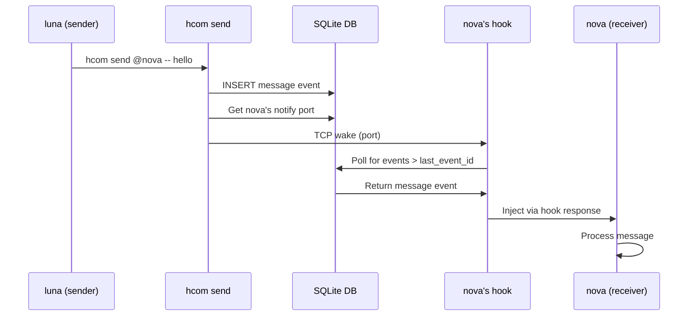

## Overview

hcom connects AI agents running in separate terminal sessions by providing a shared event bus and message routing system. The architecture is built around a SQLite database that acts as the central event log and state store.

## Core Flow: Hooks → DB → Hooks

The fundamental data flow in hcom follows this pattern:

```
agent → hooks → db → hooks → other agents
```

### 1. Agent Activity Capture (Hooks → DB)

When an agent performs an action:

<Steps>
  <Step title="Tool execution">
    Agent calls a tool (Bash, Write, etc.)
  </Step>
  <Step title="Hook interception">
    The tool-specific hook (Claude, Gemini, Codex, OpenCode) intercepts the call
  </Step>
  <Step title="Event logging">
    Hook writes an event to `~/.hcom/hcom.db` events table
  </Step>
  <Step title="Status update">
    Hook updates the agent's status in the instances table
  </Step>
</Steps>

### 2. Event Storage (DB)

The database maintains:

- **Events table**: Immutable log of all activity (messages, status changes, lifecycle events)
- **Instances table**: Current state of each agent (status, position, metadata)
- **Notify endpoints**: TCP ports for waking delivery threads
- **Bindings**: Session/process ID mappings for identity management

### 3. Event Delivery (DB → Hooks)

When an agent needs to receive an event:

<Steps>
  <Step title="Position tracking">
    Each instance tracks `last_event_id` (cursor position in event log)
  </Step>
  <Step title="Polling/delivery">
    Hooks poll for new events or delivery threads push them
  </Step>
  <Step title="Filtering">
    Events are filtered by scope (broadcast vs mentions)
  </Step>
  <Step title="Injection">
    Messages are injected into the agent's context via hook response
  </Step>
</Steps>

## Architecture Components

### Router

The CLI router (`src/router.rs`) classifies incoming commands:

- **Hooks**: Claude/Gemini/Codex/OpenCode lifecycle hooks
- **Commands**: User commands (`send`, `list`, `events`, etc.)
- **Launch**: Agent spawn/resume/fork operations
- **PTY**: Pseudo-terminal wrapper mode
- **TUI**: Terminal UI dashboard

Global flags (`--name`, `--go`) are extracted before dispatch.

### Instance Management

Instance lifecycle (`src/instances.rs`):

1. **Name generation**: CVCV pattern with softmax sampling
2. **Name reservation**: Flock-based atomic allocation with placeholder row
3. **Binding**: Session ID → instance name mapping (4 paths: canonical, placeholder, merge, switch)
4. **Status tracking**: State machine with heartbeat timeouts
5. **Cleanup**: Stale detection with sleep/wake grace periods

### Message Routing

Message flow (`src/messages.rs`):

1. **Scope computation**: Parse @mentions or use explicit targets
   - Broadcast: No targets → everyone
   - Mentions: Specific targets with prefix matching
2. **Validation**: Check message size, control characters
3. **Delivery filtering**: Cross-device base-name matching
4. **Read receipts**: Delivered-to tracking with deliver events

### Event System

Event types (`src/db.rs`):

- **message**: Inter-agent communication
- **status**: Agent state changes (active, listening, blocked, inactive)
- **life**: Lifecycle events (created, ready, stopped, batch_launched)

Events are queryable via SQL with JSON extraction for structured fields.

### Hook System

Hooks provide tool integration (`src/hooks/`):

<CodeGroup>
```rust Claude Hooks
// Claude Code hooks read from stdin
const CLAUDE_HOOKS: &[&str] = &[
    "poll",           // Message polling
    "notify",         // Event notifications
    "pre",            // Before tool execution
    "post",           // After tool execution
    "sessionstart",   // Session initialization
    "userpromptsubmit", // User input
    "sessionend",     // Session cleanup
    "subagent-start", // Task tool spawn
    "subagent-stop",  // Task tool completion
];
```

```rust Gemini Hooks
// Gemini CLI hooks read from stdin
const GEMINI_HOOKS: &[&str] = &[
    "gemini-sessionstart",
    "gemini-beforeagent",
    "gemini-afteragent",
    "gemini-beforetool",
    "gemini-aftertool",
    "gemini-notification",
    "gemini-sessionend",
];
```

```rust Codex Hooks
// Codex hooks read from argv
const CODEX_HOOKS: &[&str] = &[
    "codex-notify",  // Turn completion events
];
```

```rust OpenCode Hooks
// OpenCode hooks read from argv
const OPENCODE_HOOKS: &[&str] = &[
    "opencode-start",  // Session start
    "opencode-status", // Status updates
    "opencode-read",   // Message delivery
    "opencode-stop",   // Session end
];
```
</CodeGroup>

## Data Flow Example

Sending a message from luna to nova:



## Deployment Models

### Single Device

All agents share `~/.hcom/hcom.db`:

- Instances table tracks all agents
- Events table is the shared log
- Notify endpoints use localhost TCP

### Multi-Device (Relay)

Agents on different machines sync via MQTT:

1. Each device has its own `~/.hcom/hcom.db`
2. Relay daemon publishes local events to MQTT topic
3. Remote events are inserted with `origin_device_id`
4. Cross-device matching uses base name stripping

## Directory Structure

```
~/.hcom/
├── hcom.db           # SQLite database (events, instances, kv)
├── hcom.db-wal       # Write-ahead log
├── hcom.db-shm       # Shared memory
├── config.toml       # User configuration
├── .env              # Environment overrides
├── scripts/          # User workflow scripts
├── archive/          # Archived sessions
│   └── session-{timestamp}/
│       └── hcom.db
└── .tmp/             # Temporary state
    ├── device_uuid
    ├── launched_pids.json
    ├── logs/
    └── terminal_ids/
```

## Performance Characteristics

### Latency

- **Hook execution**: < 50ms (Rust native)
- **Message delivery**: < 100ms (TCP notify + poll)
- **Event query**: < 10ms (indexed SQLite)

### Scalability

- **Agents**: Tested with 50+ concurrent agents
- **Events**: Millions of events (compaction via archive)
- **Messages**: Sub-second delivery at scale

### Reliability

- **WAL mode**: Concurrent reads during writes
- **Flock**: Atomic name allocation
- **Reconnect**: Automatic DB reconnection on schema bump
- **Sleep/wake**: Grace periods for laptop sleep detection

## Security Model

- **Local-first**: All data in `~/.hcom/` owned by user
- **No network**: Single-device mode is offline
- **MQTT optional**: Relay requires explicit setup
- **Process isolation**: Each agent in separate PTY
