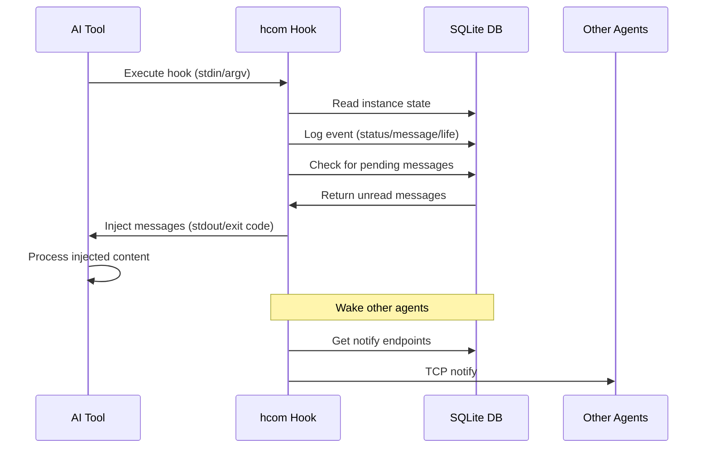

## Overview

Hooks are executable scripts that AI tools call at specific lifecycle points. hcom provides hooks for Claude Code, Gemini CLI, Codex, and OpenCode.

## Hook Flow

The hook system bridges tool execution with the hcom event database:



## Hook Types by Tool

### Claude Code Hooks

Claude hooks read from stdin and are installed at `~/.claude/hooks/`:

<Tabs>
  <Tab title="sessionstart">
    **When**: Session initialization
    
    **Payload**:
    ```json
    {
      "session_id": "sess-abc",
      "transcript_path": "/tmp/claude-transcript.jsonl",
      "agent_id": "agent-123"
    }
    ```
    
    **Actions**:
    - Bind session to instance name
    - Initialize instance in DB
    - Inject bootstrap message
    - Set status to "listening"
  </Tab>
  
  <Tab title="poll">
    **When**: Every ~30s when idle
    
    **Actions**:
    - Check for unread messages
    - Return messages in `additionalContext`
    - Update heartbeat timestamp
  </Tab>
  
  <Tab title="pre">
    **When**: Before tool execution
    
    **Payload**:
    ```json
    {
      "session_id": "sess-abc",
      "tool_name": "Bash",
      "tool_input": {"command": "ls"}
    }
    ```
    
    **Actions**:
    - Log status event: `{"status": "active", "context": "tool:Bash"}`
    - Extract file writes for collision detection
    - Check auto-approval for hcom commands
  </Tab>
  
  <Tab title="post">
    **When**: After tool execution
    
    **Payload**:
    ```json
    {
      "session_id": "sess-abc",
      "tool_name": "Bash",
      "tool_input": {"command": "ls"},
      "tool_response": {"stdout": "file1.txt\nfile2.txt"}
    }
    ```
    
    **Actions**:
    - Log status event: `{"status": "listening"}`
    - Check for file collisions
    - Send collision notifications
  </Tab>
  
  <Tab title="sessionend">
    **When**: Session termination
    
    **Actions**:
    - Log stopped event: `{"action": "stopped", "reason": "exit:0"}`
    - Set status to "inactive"
    - Cleanup notify endpoints
  </Tab>
  
  <Tab title="subagent-start">
    **When**: Task tool spawns child agent
    
    **Payload**:
    ```json
    {
      "session_id": "sess-abc",
      "parent_session_id": "sess-parent"
    }
    ```
    
    **Actions**:
    - Create subagent instance with `parent_session_id`
    - Update parent's `running_tasks`
  </Tab>
  
  <Tab title="subagent-stop">
    **When**: Task tool child completes
    
    **Actions**:
    - Remove from parent's `running_tasks`
    - Log stopped event
  </Tab>
</Tabs>

### Gemini CLI Hooks

Gemini hooks read from stdin and are installed at `~/.gemini/hooks/`:

<Tabs>
  <Tab title="gemini-sessionstart">
    Same as Claude sessionstart.
  </Tab>
  
  <Tab title="gemini-beforeagent">
    **When**: Before model processes turn
    
    **Actions**:
    - Check for pending messages
    - Inject via `additionalContext`
  </Tab>
  
  <Tab title="gemini-afteragent">
    **When**: After model response
    
    **Actions**:
    - Update heartbeat
    - Set status to "listening"
  </Tab>
  
  <Tab title="gemini-beforetool">
    Same as Claude pre hook.
  </Tab>
  
  <Tab title="gemini-aftertool">
    Same as Claude post hook.
  </Tab>
  
  <Tab title="gemini-notification">
    **When**: Tool approval needed
    
    **Payload**:
    ```json
    {
      "notification_type": "ToolPermission",
      "tool_name": "run_shell_command"
    }
    ```
    
    **Actions**:
    - Set status to "blocked"
  </Tab>
  
  <Tab title="gemini-sessionend">
    Same as Claude sessionend.
  </Tab>
</Tabs>

### Codex Hooks

Codex hook reads from argv (JSON payload as arg) and is installed at `~/.codex/hooks/notify.sh`:

<Tabs>
  <Tab title="codex-notify">
    **When**: After agent turn completes
    
    **Payload** (argv[2]):
    ```json
    {
      "type": "agent-turn-complete",
      "thread-id": "thread-abc",
      "turn-id": "turn-123",
      "cwd": "/home/user/project"
    }
    ```
    
    **Actions**:
    - Bind thread-id to instance
    - Set status to "listening"
    - Update heartbeat
  </Tab>
</Tabs>

### OpenCode Hooks

OpenCode hooks are native Rust functions, not shell scripts:

<Tabs>
  <Tab title="opencode-start">
    **When**: Session start
    
    **Actions**:
    - Bind session to instance
    - Initialize instance
    - Return bootstrap message
  </Tab>
  
  <Tab title="opencode-status">
    **When**: Status polling (~5s)
    
    **Actions**:
    - Check for pending messages
    - Return count or formatted messages
  </Tab>
  
  <Tab title="opencode-read">
    **When**: User requests message delivery
    
    **Actions**:
    - Get unread messages
    - Format for injection
    - Update cursor
  </Tab>
  
  <Tab title="opencode-stop">
    **When**: Session end
    
    **Actions**:
    - Log stopped event
    - Cleanup
  </Tab>
</Tabs>

## Hook Results

Hooks return results via exit code and stdout:

### Allow (exit 0)

Operation proceeds normally:

```json
{
  "additionalContext": "<hcom>[new message #42] nova → luna: hello</hcom>",
  "systemMessage": "Updated system context"
}
```

### Block (exit 2)

Operation blocked (used for message delivery):

```json
{
  "reason": "<hcom>[request #42] nova → luna: can you help?</hcom>"
}
```

Claude/Gemini interpret this as "wait for user input" and inject the reason text.

### Update Input (exit 0)

Modify tool arguments before execution:

```json
{
  "updatedInput": {
    "command": "modified command"
  }
}
```

## Hook Payload Normalization

Each tool has different JSON formats. The `HookPayload` struct normalizes them:

```rust
pub struct HookPayload {
    pub session_id: String,
    pub transcript_path: String,
    pub hook_name: String,
    pub tool: String,
    pub tool_name: String,
    pub tool_input: Value,
    pub tool_result: String,
    pub notification_type: String,
    pub raw: Value,
}

// Build from tool-specific JSON
let payload = HookPayload::from_claude(&raw);
let payload = HookPayload::from_gemini(&raw);
let payload = HookPayload::from_codex(&raw);
let payload = HookPayload::from_opencode(&raw);
```

## Hook Installation

### Automatic Installation

Hooks are installed on first launch:

```bash
hcom claude  # Installs ~/.claude/hooks/ if missing
hcom gemini  # Installs ~/.gemini/hooks/ if missing
hcom codex   # Installs ~/.codex/hooks/notify.sh if missing
```

### Manual Installation

```bash
# Add hooks for specific tool
hcom hooks add claude
hcom hooks add gemini
hcom hooks add codex
hcom hooks add opencode  # Config file only

# Add all hooks
hcom hooks add all

# Check status
hcom hooks status

# Remove hooks
hcom hooks remove claude
hcom hooks remove all
```

### Hook Locations

<CodeGroup>
```bash Claude
~/.claude/hooks/
├── pre
├── post
├── poll
├── notify
├── sessionstart
├── sessionend
├── userpromptsubmit
├── subagent-start
└── subagent-stop
```

```bash Gemini
~/.gemini/hooks/
├── sessionstart
├── beforeagent
├── afteragent
├── beforetool
├── aftertool
├── notification
└── sessionend
```

```bash Codex
~/.codex/hooks/
└── notify.sh
```

```bash OpenCode
~/.config/opencode/config.json
# hcom integration via config
```
</CodeGroup>

## Hook Context

Hooks access hcom via environment variables:

```bash
HCOM_PROCESS_ID     # Unique process identifier
HCOM_LAUNCHED       # "1" if launched by hcom
HCOM_LAUNCHED_BY    # Name of launcher agent
HCOM_LAUNCH_BATCH_ID # Batch identifier
HCOM_LAUNCH_EVENT_ID # Event cursor at launch
HCOM_DIR            # Override default ~/.hcom
HCOM_SID            # Session ID (for subagents)
```

## Shared Hook Functions

Core hook logic is shared across tools:

### Identity Initialization

```rust
pub fn init_hook_context(
    db: &HcomDb,
    payload: &HookPayload,
) -> Result<String> {
    // Bind session to process
    let name = bind_session_to_process(
        db,
        payload.session_id_opt(),
        std::env::var("HCOM_PROCESS_ID").ok().as_deref(),
    ).unwrap_or_else(|| {
        // Create new instance
        generate_unique_name(db).unwrap()
    });
    
    // Initialize instance fields
    initialize_instance_in_position_file(
        db,
        &name,
        payload.session_id_opt(),
        None, // parent_session_id
        None, // parent_name
        None, // agent_id
        payload.transcript_path_opt(),
        Some(&payload.tool),
        false, // background
        None, // tag
        None, // wait_timeout
        None, // subagent_timeout
        None, // hints
    );
    
    Ok(name)
}
```

### Message Delivery

```rust
pub fn deliver_pending_messages(
    db: &HcomDb,
    name: &str,
) -> Option<String> {
    let messages = db.get_unread_messages(name);
    if messages.is_empty() {
        return None;
    }
    
    let formatted = format_messages_json(
        &messages,
        name,
        &|n| db.get_instance_full(n).ok().flatten().map(|d| /* ... */),
        &|| Config::get().hints.unwrap_or_default(),
        Some(&|inst, tip_key| {
            let seen = db.kv_get(&format!("tip:{}:{}", inst, tip_key))
                .ok()
                .flatten()
                .is_some();
            let mark = Box::new(|| {
                let _ = db.kv_set(&format!("tip:{}:{}", inst, tip_key), Some("1"));
            });
            (seen, mark)
        }),
    );
    
    Some(formatted)
}
```

### Bootstrap Injection

```rust
pub fn inject_bootstrap_once(
    db: &HcomDb,
    name: &str,
) -> Option<String> {
    // Check if already announced
    if let Ok(Some(data)) = db.get_instance_full(name) {
        if data.name_announced != 0 {
            return None;
        }
    }
    
    // Mark as announced
    db.update_instance_fields(name, &json!({"name_announced": 1}));
    
    // Build bootstrap message
    let welcome = format!(
        "You are connected to hcom as @{}. \
         Other agents can send you messages with `hcom send @{}`. \
         You can send messages with `hcom send @<name> -- <message>`.",
        name, name
    );
    
    Some(welcome)
}
```

### Session Finalization

```rust
pub fn finalize_session(
    db: &HcomDb,
    name: &str,
    reason: &str,
) {
    // Log stopped event
    let _ = db.log_event("life", name, &json!({
        "action": "stopped",
        "reason": reason
    }));
    
    // Set status inactive
    let _ = db.set_status(name, "inactive", reason);
}
```

## Hook Performance

### Execution Time

- **Rust native**: < 50ms (open DB, query, close)
- **Stdin parsing**: < 10ms (JSON deserialization)
- **Event logging**: < 5ms (SQLite insert)
- **Message formatting**: < 20ms (DB query + string ops)

### Optimization

- **Connection reuse**: WAL mode allows concurrent reads
- **Index usage**: Queries use `(type, instance)` index
- **Lazy formatting**: Only format messages when needed
- **Batch operations**: Group DB writes in single transaction

## Hook Development

Creating hooks for new tools:

<Steps>
  <Step title="Define hook points">
    Identify tool lifecycle events (start, stop, before/after tool)
  </Step>
  <Step title="Create HookPayload constructor">
    Add `from_{tool}()` method to normalize tool JSON
  </Step>
  <Step title="Implement dispatchers">
    Add hook handlers in `src/hooks/{tool}.rs`
  </Step>
  <Step title="Register hooks">
    Add hook names to router registry
  </Step>
  <Step title="Add installation">
    Update `hcom hooks add {tool}` command
  </Step>
</Steps>

Example hook handler:

```rust
pub fn handle_tool_hook(hook_name: &str) -> i32 {
    // Read payload
    let payload = read_hook_payload_stdin();
    let payload = HookPayload::from_tool(&payload);
    
    // Open DB
    let db = HcomDb::open().unwrap();
    db.ensure_schema().unwrap();
    
    // Initialize identity
    let name = init_hook_context(&db, &payload).unwrap();
    
    // Hook-specific logic
    match hook_name {
        "start" => handle_start(&db, &name, &payload),
        "stop" => handle_stop(&db, &name, &payload),
        "before" => handle_before(&db, &name, &payload),
        "after" => handle_after(&db, &name, &payload),
        _ => HookResult::Allow { 
            additional_context: None,
            system_message: None 
        }
    };
    
    // Return exit code
    result.exit_code()
}
```
